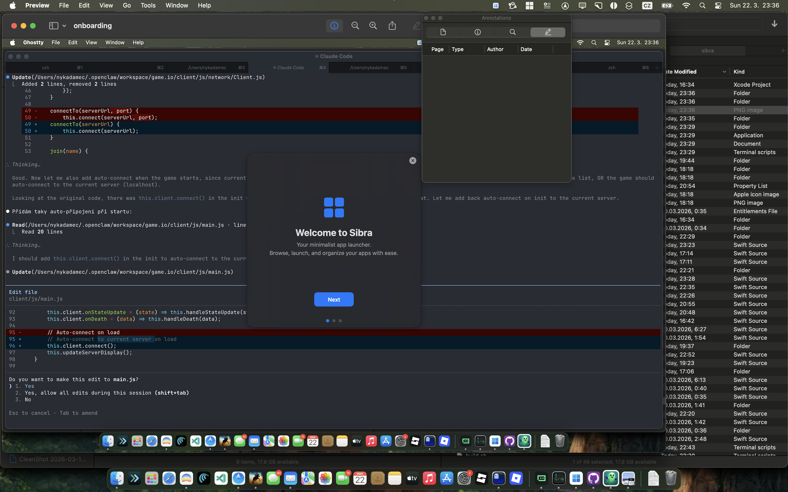

# Sibra — macOS App Launcher

A minimalist, native macOS app launcher with a glass-styled floating window, global hotkey, and menu bar presence.



## Features

- **App Grid** — Browse all installed applications in a responsive icon grid
- **Search** — Instant filtering as you type
- **Global Hotkey** — Press `⌃ Space` (configurable) to toggle the window from anywhere
- **Menu Bar** — Runs as a status bar app — no Dock icon
- **Categories** — Organize apps into custom categories via drag & drop
- **Favourites** — Pin frequently used apps for quick access
- **Onboarding** — First-launch guide walks you through setup
- **macOS Native** — Built with SwiftUI + AppKit, zero third-party dependencies

## Requirements

- **macOS 14.0+** (Ventura or later)
- **Arm64 or Intel** (universal binary)

## Installation

### Build from Source

```bash
git clone https://github.com/your-org/sibra.git
cd sibra
./build.sh
open build/Sibra.app
```

### First Launch

On first launch you'll see the onboarding screen. It explains the global hotkey (`⌃ Space`) and confirms you're ready to go.

To reset the onboarding screen after the first run:

```bash
./reset-onboarding.sh
```

## Usage

| Action | How |
|--------|-----|
| Show/Hide window | `⌃ Space` (customizable in Settings) |
| Launch app | Click or press `Enter` on selected |
| Search | Start typing in the search bar |
| Favourite | Hover → right-click → Favourite |
| Uninstall | Hover → right-click → Uninstall |
| Reveal in Finder | Hover → right-click → Reveal in Finder |
| Settings | Click ⚙️ in top-right corner |
| Quit | Menu bar icon → Quit |

## Settings

Open Settings via the ⚙️ button or the menu bar icon. Available options:

- **Window opacity** — Adjust transparency (live preview)
- **Icon size** — Small / Normal / Big
- **Theme** — System / Light / Dark
- **Categories** — Enable/disable sidebar
- **Show system apps** — Include macOS system apps
- **Global hotkey** — Customize the toggle shortcut

## Architecture

```
Sources/
├── App/
│   ├── main.swift              # Manual NSApplication entry point
│   └── AppDelegate.swift       # App lifecycle
├── Utilities/
│   ├── WindowManager.swift     # Window state, opacity, lifecycle
│   └── HotkeyManager.swift     # Global hotkey via Carbon API
├── ViewModels/
│   └── AppsViewModel.swift     # @Observable app state
├── Models/
│   └── UserData.swift          # Persistence (JSON), categories, settings
└── Views/
    ├── ContentView.swift       # Root SwiftUI view
    ├── AppGridView.swift       # LazyVGrid layout
    ├── AppIconCardView.swift   # App card with hover states
    ├── SearchBarView.swift     # Search input
    ├── CategorySidebarView.swift # Category sidebar
    ├── FavouritesRowView.swift  # Pinned apps row
    ├── SettingsView.swift      # Settings sheet
    └── OnboardingView.swift     # First-launch guide
```

## Keyboard Shortcuts

| Key | Action |
|-----|--------|
| `↑ ↓ ← →` | Navigate app grid |
| `Enter` / `Return` | Launch selected app |
| `⌘ Enter` | Reveal selected app in Finder |
| `Escape` | Hide window |
| `⌃ Space` | Toggle Sibra (global, works from any app) |

## Permissions

Sibra requires **Accessibility** permission to register global keyboard shortcuts. On first global hotkey use, macOS will prompt you to grant access in **System Settings → Privacy & Security → Accessibility**.

## Data Storage

All user data is stored in:

```
~/Library/Application Support/Sibra/data.json
```

Includes: categories, favourites, pinned hotkeys, and all settings.

## Tech Stack

- **Swift 6** + **SwiftUI** + **AppKit**
- **Carbon API** for global hotkey registration
- No third-party dependencies
- Swift build script (`build.sh`) — no Xcode required

## License

MIT
